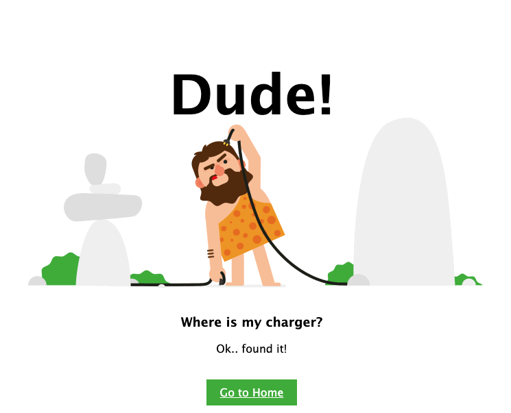

# Simple Node App

Simple Node App

**Link to project** https://dark-tan-gosling-wrap.cyclic.app/

**Tech used:** HTML, CSS, Node.js

## Optimizations to do:

- Build it with support of Express.js instead of clean Node.js

## Lessons Learned:

fs, path and url modules usage.
